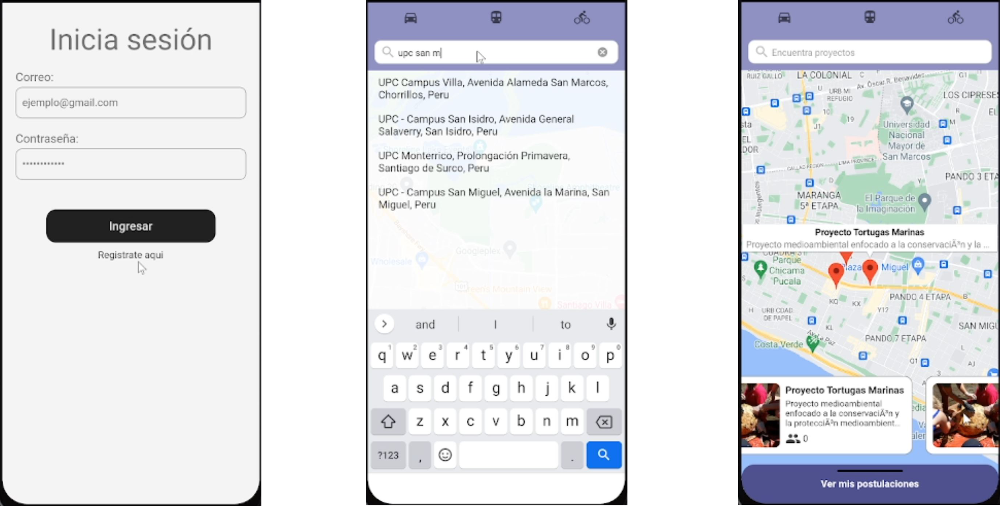
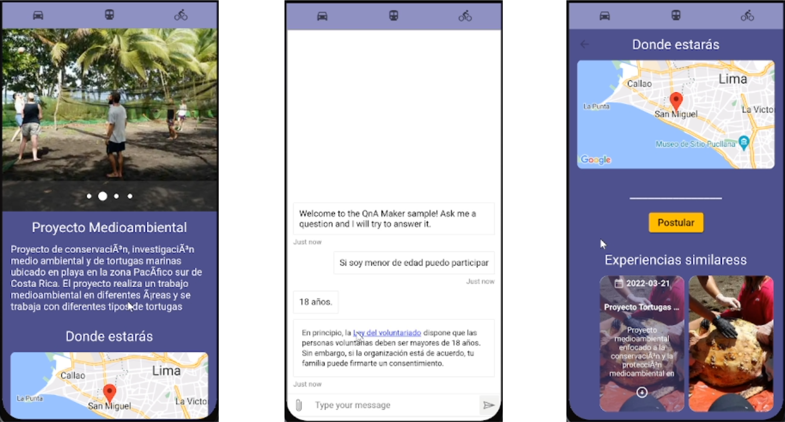

# Overview

Mobile app that aims to help tourists to locate and learn about different historical places of Lima city

#### Backend

This mobile app is dependent on a RESTful API that can be accessed [here](https://github.com/WS82-Techlife/TechLife-RestApi/tree/develop)

#### Showcase

